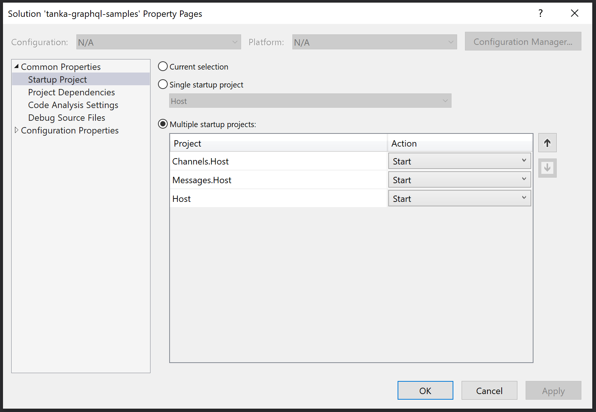

# Tanka GraphQL sample

Example of using tanka-graphql with Apollo

Live at: https://tanka-chat.heikura.me/ (Might be occassionally down for maintenance)


## Projects

* Host - this acts as an gateway to Channels and Messages services
* ClientApp - SPA frontend using React and Apollo
* Channels.Host - provides channels graphql service (signalr, http)
* Messages.Host - provides messages graphql service (signalr)

Host project uses introspection to build remote executable schemas 
from Channels and Messages services.


## Requirements

- nodeJS
- latest VS 2019 (or just use command prompt and VS Code)
- dotnet sdk 3.1
- Auth0 tenant with SPA and API applications created
- tanka.graphql.generator.tool installed (run `dotnet tool restore`)


## Run the sample


### Docker

```bash
docker-compose up
```

Open http://localhost:5001 in web browser.


### Visual Studio

Open solution properties and select the projects to start.




## Solution

Sample uses Auth0 to provide GitHub login for the application. The default values in the repo
might not work for you and it's recommended you configure your own tenant in Auth0 and modify
settings to match.


### ClientApp

Frontend uses Auth0 for authentication. Create SPA application in Auth0 and modify .env file at the
root of `src\ClientApp` directory with the settings of your application. The app uses userprofile
to show who is participating in the chat.

Url: https://localhost:5001

React frontend application with small NodeJS server.

Uses randomly either tanka-graphql-server-link or apollo-link-ws to communicate with server.


### Backend

Select multiple projects in the debug options of the solution and make sure Host is the last one to launch.

Backend uses Auth0 for JWT validation and authorization. Create API in Auth0 and set your settings
in appsettings.json files in the web projects in the solution.

```json
"JWT": {
	"Authority": "<authority",
	"Audience": "<audience>"
}
```


#### Host

Host project uses the introspection query to build a single executable schema from the GraphQL
endpoints provided by Messages.Host and Channels.Host. This allows splitting the application 
into multiple smaller services while still providing single access point for the clients. Provides
SignalR based GraphQL server for clients using tanka-graphql-server-link and WebSockets based
GraphQL server for client using apollo-link-ws.

Host uses SignalR link or Http link to talk to the Channels service based on the operation type.


#### Messages.Host

Messages host uses Auth0 userinfo endpoint to fetch additional claims about the user. It also
adds the current user into the arguments of the resolver so resolver can access the `ClaimsPrincipal`.

Messages host also provides a streaming subscription support for chat message events.


#### Channels.Host

Channels host provides functions for getting list of channels.
